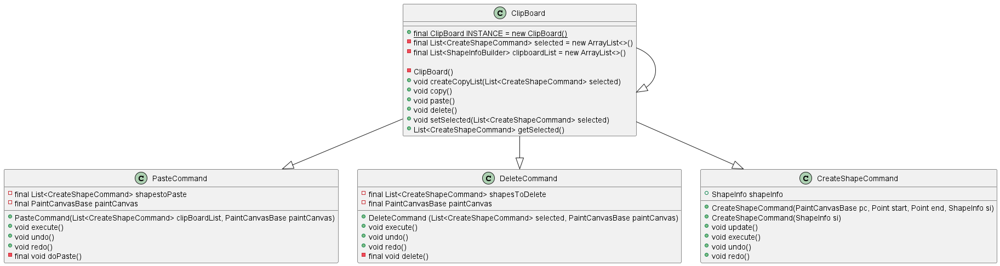
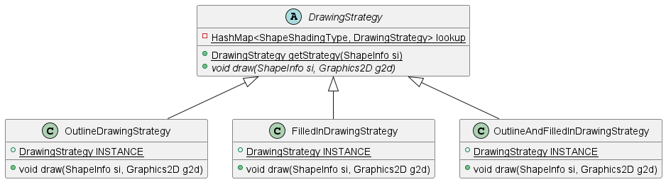
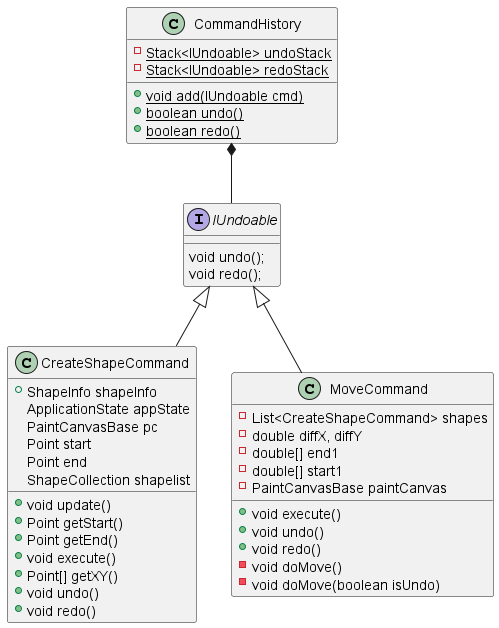
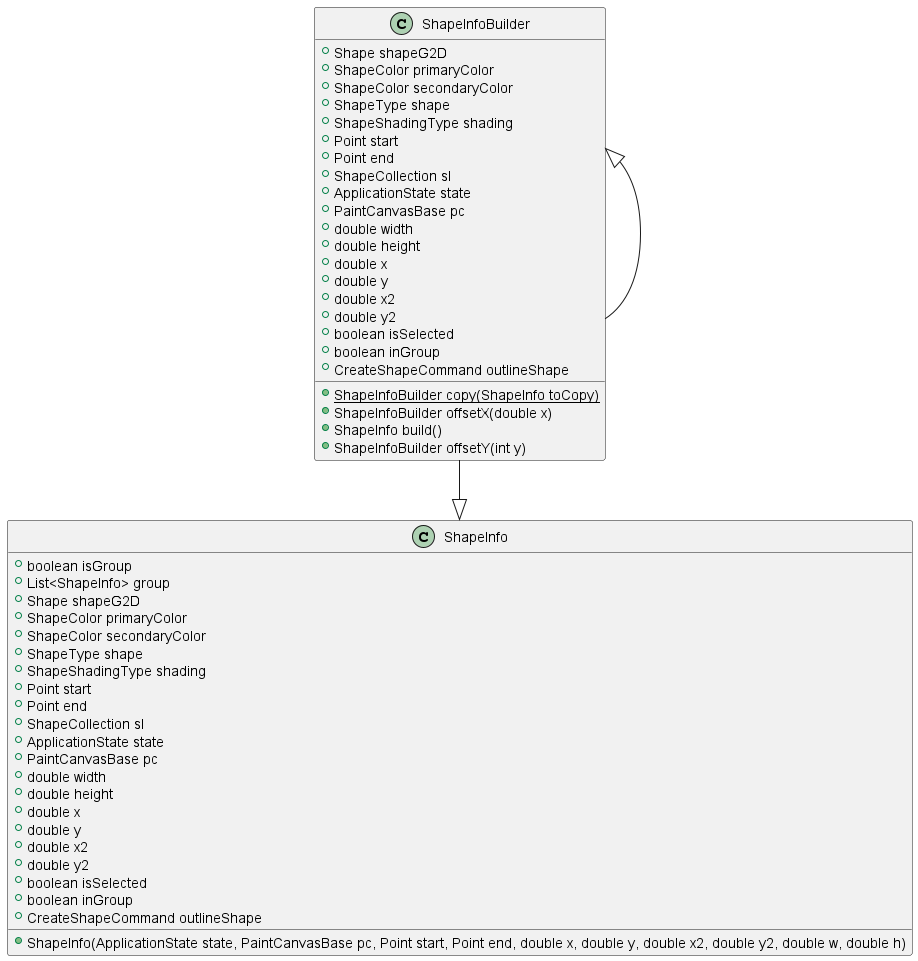
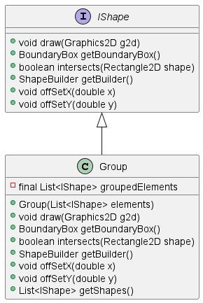

# JPaint_Becht
 Olivia Becht repo for JPaint application for SE450

  

## Link to GitHub Repo
https://github.com/olioli37653/JPaint_Becht

 

## Design Patterns 

 

### ClipBoard (Singleton)

[Clipboard.java](src/model/ClipBoard.java)  
[PasteCommand.java](src/model/Commands/PasteCommand.java)  
[DeleteCommand.java](src/model/Commands/DeleteCommand.java)  
[CreateShapeCommand.java](src/controller/CreateShapeCommand.java)

 

### DrawingStrategy (Strategy)

[DrawingStrategy.java](src/drawing/DrawingStrategy.java)  
[OutlineDrawingStrategy.java](src/drawing/OutlineDrawingStrategy.java)  
[FilledInDrawingStrategy.java](src/drawing/FilledInDrawingStrategy.java)  
[OutlineAndFilledInDrawingStrategy.java](src/drawing/OutlineAndFilledInDrawingStrategy.java)

 

### CommandHistory (Command)

[CommandHistory.java](src/model/Commands/CommandHistory.java)  
[IUndoable.java](src/model/interfaces/IUndoable.java)  
[CreateShapeCommand.java](src/controller/CreateShapeCommand.java)  
[MoveCommand.java](src/model/Commands/MoveCommand.java)

 

### ShapeInfoBuilder (Builder)

[ShapeInfoBuilder.java](src/model/shape/ShapeInfoBuilder.java)  
[ShapeInfo.java](src/model/shape/ShapeInfo.java)

 

### Group (Composite)

[IShape.java](src/model/shape/IShape.java)  
[Group.java](src/model/shape/Group.java)

